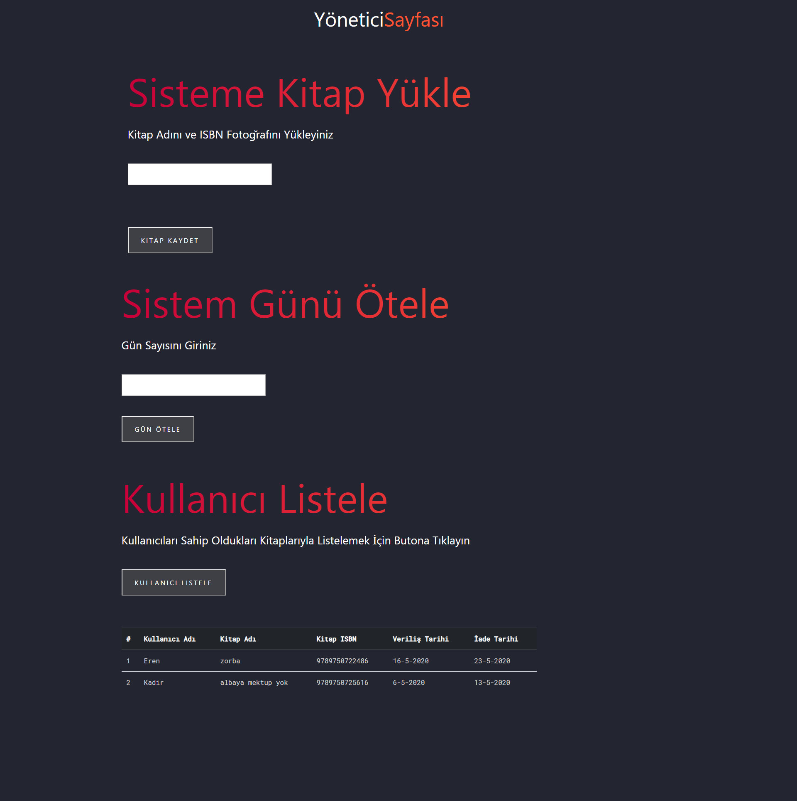

# Kütüphane Uygulaması

## Projenin Amacı 
Localhostta çalışan, ISBN numarasını resimden okuyabilen, veri tabanına kitap adı, ISBN numarası, kullanıcı bilgisi vs. gibi verileri işleyebilen bir kütüphane uygulaması oluşturmak.

## Projenin Sahip Olduğu Fonksiyonlar
###### Yönetici Tarafı
- Kitap adı ile birlikte kitabın ISBN kodunu fotoğraftan okuyarak kitap bilgisinin eklenmesi.
- Sistem zamanını belirtilen gün kadar ötelenmesi.
- Kitap alan kullanıcıların hangi kitabı, hangi tarihte aldığı, kitabın ISBN numarası, kitabın iade tarihi gibi bilgilerle listelenmesi.

###### Kullanıcı Tarafı
- Kitap adı veya ISBN'e göre kütüphanede veri tabanında arama yapılması.
- Kitap adı veya ISBN'e göre kitabın kullanıcı envanterine eklenmesi.
- Kitabın ISBN kodunun bulunduğu fotoğrafı sisteme yükleyerek, daha önceden alınan kitabın kütüphaneye iade edilmesi.

> Projenin server tarafı Nodejs, veri tabanı kısmı Mongodb, arayüz kısmında ise HTML, CSS ile yazıldı.

## Projede Kullanılan Paketler
- [express](https://expressjs.com)
- [express-fileupload](https://www.npmjs.com/package/express-fileupload)
- [mongoose](https://mongoosejs.com)
- [tesseract.js](https://github.com/naptha/tesseract.js#installation)
- [nodemon](https://www.npmjs.com/package/nodemon)

## Proje Dökümanı
[Döküman](https://www.dropbox.com/s/16o1yfhsh96erup/YazlabII-Proje1.pdf?dl=0)

## Ekran Görüntüleri

 

 

